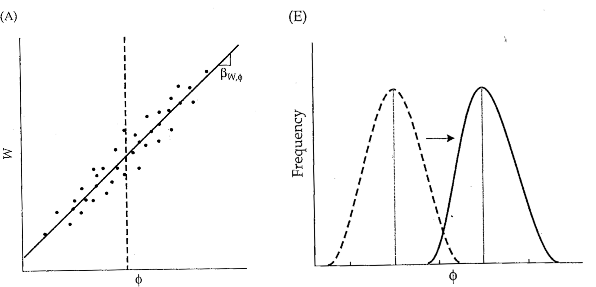

---
title: "Introdução à Genética Quantitativa Evolutiva"
author: "Diogo Melo"
date: diogro@usp.br
logo: logo.png
output:
  ioslides_presentation:
    transitions: faster
    self_contained: true
    widescreen: false
    fig_caption: true
    css: extra.css
csl: evolution.csl
bibliography: ModCurso.bib
editor_options: 
  chunk_output_type: console
---	

<style>
@import url('https://fonts.googleapis.com/css?family=Crimson+Text|Lora:700|Open+Sans+Condensed:300');

slides > slide:not(.nobackground):after {
    font-family: 'Crimson Text', serif;
}

.forceBreak { 
	-webkit-column-break-after: always; 
	break-after: column; 
}

div.footnotes {
  position: absolute;
  bottom: 0;
  margin-left: 50px;
  margin-bottom: 10px;
  width: 80%;
  font-family: 'Crimson Text';
  font-size: 0.6em;
}

img {
    max-height: 560px;
    max-width: 964px;
}
</style>


<script src="https://ajax.googleapis.com/ajax/libs/jquery/3.1.1/jquery.min.js"></script>

<script type="text/x-mathjax-config">
  MathJax.Hub.Config({ TeX: { extensions: ["color.js"] }});
</script>

<style>
.math {
  font-size: huge;
}
</style>

<script>
$(document).ready(function() {
  $('slide:not(.backdrop):not(.title-slide)').append('<div class=\"footnotes\">');
  $('footnote').each(function(index) {
    var oldChars = $(this).html();
    var fnNum    = (index+1).toString().sup();
    var newChars = oldChars + fnNum;
    $(this).html(newChars);
   	var content = fnNum + ': ' + $(this).attr('content') + '<br/>';
	var oldContent = $(this).parents('slide').children('div.footnotes').html();
    var newContent = oldContent + content;
    $(this).parents('slide').children('div.footnotes').html(newContent);
  });
});
</script>

```{r setup, include=FALSE}
knitr::opts_chunk$set(echo = FALSE)
library(knitr)
if(!require(png)){install.packages("png"); library(png)}
if(!require(jpeg)){install.packages("jpeg"); library(jpeg)}
knit_hooks$set(plot = function(x, options) {
  paste('<figure><figcaption>', options$fig.cap, '</figcaption></figure>',
        sep = '')
})
```

## A teoria evolutiva completa num pacote "simples"

- O teorema de Price fornece uma fundamentação teórica para a teoria evolutiva.

- É um teorema, não uma teoria. É derivado de primeiros princípios.

- Relaciona sucesso relativo em deixar descendentes com mudança no fenótipo.

## Algumas identidades preparatórias

 - O valor esperado de $\huge x = \{x_1, x_2, \cdots, x_N\}$ é definido como:
 
$$
\Huge E(x) = \overline x = \frac{1}{N} \sum_{i=1}^N x_i
$$

- Variância de $\huge x$ é definida como:

$$
\Huge Var(x) = \frac{1}{N} \sum_{i=1}^N (x_i - \overline{x})^2
$$

## Algumas identidades preparatórias

- Covariancia entre $\huge x$ e $\huge y$ é definida como:


$$
\Huge Cov(x, y) = \frac{1}{N} \sum_{i=1}^N (x_i - \overline{x})(y_i - \overline{y})
$$

## Algumas identidades preparatórias

- Covariancia entre $\huge x$ e $\huge y$ é definida como:


$$
\Huge Cov(x, y) = \frac{1}{N} \sum_{i=1}^N (x_i - \overline{x})(y_i - \overline{y})
$$

- Covariancia entre $\huge x$ e $\huge y$ é igual a diferença entre a média do produto e o produto das médias:

$$
\Huge Cov(x, y) = E(xy) - \overline x \cdot \overline y
$$

## Algumas identidades preparatórias {.columns-2 .smaller}

- O coeficiente de regressão linear de $\huge y$ em $\huge x$ é igual a covariância entre eles dividido pela variância de $\huge x$

$$
\Huge \beta_{y, x} = \frac{Cov(x, y)}{Var(x)}
$$

```{r, echo = FALSE, fig.height = 2, fig.width = 2, fig.align = "center"}
suppressMessages(if(!require(ggplot2)){install.packages("ggplot2"); library(ggplot2)})
suppressMessages(if(!require(dplyr)){install.packages("dplyr"); library(dplyr)})
xy = data.frame(x = rnorm(50, 2)) %>% mutate(y = 2 + x + rnorm(50, 0.1))
ggplot(xy, aes(x, y)) + geom_point(size = 0.5) + geom_smooth(method = lm, color = "black" , se = FALSE) + theme_classic()
```

## Esquema da demonstração

{width=100%}


- Duas gerações, fenótipo $\huge \phi$ nos parentais, descendentes com fenótipo $\huge \phi_i + \delta_{i,j}$
- $\huge N$ indivíduos parentais, $\huge W_i$ descendentes por parental
- Médias: $\huge \overline \phi$, $\huge \overline \delta_{i}$, $\huge \overline W$

## Média da geração dos descendentes

$$
\huge \phi' = \frac{\sum\limits_{i=1}^N \sum\limits_{j=1}^{W_i} \left ( \phi_i + \delta_{i, j} \right )}{\sum\limits_{i=1}^N W_i}
$$

## Média da geração dos descendentes

$$
\huge \phi' = \frac{\sum\limits_{i=1}^N \sum\limits_{j=1}^{W_i} \left ( \phi_i + \delta_{i, j} \right )}{\sum\limits_{i=1}^N W_i} = \frac{\sum\limits_{i=1}^N \left ( \sum\limits_{j=1}^{W_i} \phi_i + \sum\limits_{j=1}^{W_i} \delta_{i, j} \right )}{\sum\limits_{i=1}^N W_i}
$$

## Média da geração dos descendentes

$$
\huge \phi' = \frac{\sum\limits_{i=1}^N \sum\limits_{j=1}^{W_i} \left ( \phi_i + \delta_{i, j} \right )}{\sum\limits_{i=1}^N W_i} = \frac{\sum\limits_{i=1}^N \left ( \sum\limits_{j=1}^{W_i} \phi_i + \sum\limits_{j=1}^{W_i} \delta_{i, j} \right )}{\sum\limits_{i=1}^N W_i}
$$

$$ 
\Huge \sum\limits_{j=1}^{W_i} \phi_i = W_i \phi_i \; \; \; \; \; \; \; \; \; \; \; \sum\limits_{j=1}^{W_i} \delta_{i, j} = W_i\overline \delta_i 
$$

$$ 
\Huge \sum\limits_{i=1}^{N} W_i = N\overline W 
$$

## Substituindo...

$$
\Huge \phi' = \frac{1}{N\overline W} \left [ \sum\limits_{i=1}^{N} W_i\phi_i + \sum\limits_{i=1}^{N} W_i\overline \delta_i  \right ]
$$

## Achando as médias

$$
\Huge \phi' = \frac{1}{N\overline W} \left [ \sum\limits_{i=1}^{N} W_i\phi_i + \sum\limits_{i=1}^{N} W_i\overline \delta_i  \right ] =
$$
$$
\Huge \phi' = \frac{1}{\overline W} \left [ E(W\phi) + E( W\overline \delta) \right ]
$$

## Aparece uma covariância...


Lembrando que:
$$
\Huge Cov(x, y) = E(xy) - \overline x \cdot \overline y
$$

Subsituindo $\huge E(W\phi)$ por $\huge Cov(W, \phi) + \overline W  \cdot \overline  \phi$:

$$
\Huge \phi' = \frac{1}{\overline W} \left [ E(W\phi) + E( W\overline \delta) \right ]
$$

$$
\Huge \phi' = \frac{1}{\overline W} \left [ Cov(W, \phi) + \overline W \cdot \overline \phi + E( W\overline \delta) \right ]
$$

## Teorema de Price

$$
\Huge \phi' = \frac{1}{\overline W} \left [ Cov(W, \phi) + \overline W \cdot \overline \phi + E( W\overline \delta) \right ]
$$

$$
\Huge \boxed {\phi' - \phi = \frac{1}{\overline W} \left [ Cov(W, \phi) + E( W\overline \delta) \right ]}
$$

## Teorema de Price

Mudança fenotípica tem 2 termos
$$
\huge \boxed {\phi' - \phi = \frac{1}{\overline W} \left [ Cov(W, \phi) + E( W\overline \delta) \right ]}
$$

- Seleção e deriva
$$
\huge \frac{1}{\overline W}Cov(W, \phi)
$$

- Reprodução (recombinação, regressão à média, ...)
$$
\huge \frac{1}{\overline W}E( W\overline \delta)
$$

## Alguns aspectos do teorema

- Mudança ao longo do tempo (não precisa ser geracional);

- Fenótipos são totalmente genéricos (podem ser frequências alélicas, ou funções de $\huge \phi$, ...);

- Relação ancestral-descendente pode ser qualquer coisa;

- Teorema estabelece a algebra entre fenótipo, aptidão, herança e evolução;

- Covariâncias, regressões e médias não tem nada a ver com estatística.

## Diferencial de seleção


$$
\Huge \boxed {S = Cov(w, \phi)}
$$
- $\huge S$ é uma medida da mudança no fenótipo dentro de uma geração.


## Diferencial de seleção


$$
\Huge \boxed {S = Cov(w, \phi)}
$$
- $\huge S$ é uma medida da mudança no fenótipo dentro de uma geração.

Lembrando que $\huge \beta_{y, x} = \frac{Cov(x, y)}{Var(x)}$

$$
\huge S = Cov(w, \phi) = \beta_{w, \phi} Var(\phi)
$$

## Diferencial de seleção


$$
\Huge \boxed {S = Cov(w, \phi)}
$$

- $\huge S$ é uma medida da mudança no fenótipo dentro de uma geração.

Lembrando que $\huge \beta_{y, x} = \frac{Cov(x, y)}{Var(x)}$

$$
\huge S = Cov(w, \phi) = \beta_{w, \phi} Var(\phi)
$$

- $\huge \beta_{w, \phi}$ é chamado de __gradiente de seleção__.

## Gradiente de seleção {.centered}

{width=50%}

## Gradiente de seleção linear {.centered}


{width=100%}

## Gradiente de seleção não-linear {.centered}


{width=100%}

- Covariância entre desvios quadrados e aptidão determinam evolução da __variância__ de um fenótipo.

## Gradiente de seleção não-linear {.centered}


{width=100%}

## Gradiente de seleção não-linear {.centered}


{width=100%}


## Relação entre pais e filhos

Fenótipo médio dos descendentes de um ancestral

$$
\Huge \phi_i^o = \phi_i + \overline \delta_i
$$

$$
\Huge \Delta \overline \phi = \frac{1}{\overline W} \left [ Cov(W, \phi) + E( W\overline \delta) \right ]
$$

Trocando o segundo termo por uma covariância:

$$
\Huge \Delta \overline \phi = \frac{1}{\overline W} \left [ Cov(W, \phi) + Cov(W, \overline \delta) + \overline W E(\overline \delta)\right ]
$$


## Juntando as covariâncias:

$$
\Huge \Delta \overline \phi = \frac{1}{\overline W} \left [ Cov(W, \phi + \overline \delta) \right ] + E(\overline \delta)
$$


$$
\Huge \boxed {\Delta \overline \phi = \frac{1}{\overline W} \left [ Cov(W, \phi^o) \right ] + \overline \delta_T}
$$

- $\huge \overline \delta_T$ é a média das diferenças entre pais e filhos (não depende da aptidão)

$$
\Huge  \overline \delta_T = \overline {\phi^o} - \overline {\phi}
$$

## Interpretando $Cov(W, \phi^o)$


- O termo $\huge Cov(W, \phi^o)$ resume todos os aspectos de seleção, deriva, herança.
- Resumo: O que importa para a evolução é a covariância entre a aptidão dos pais e fenótipo dos filhos.
- Bonus: relação entre fenótipo e aptidão não precisa ser causal! Deriva vem de brinde.

## Interpretando $\large \overline \delta_T$ {.centered}

{width=70%}

## Interpretando $\large \overline \delta_T$ {.centered}

{width=60%}

## Relação linear entre fenótipo dos pais e filhos

$$
\Huge \boxed {\Delta \overline \phi = \frac{1}{\overline W} Cov(W, \phi^o) }
$$

$$
\Huge \phi^o_i = \overline \phi + \beta_{\phi^o, \phi} (\phi_i - \overline \phi)
$$

Subsituindo na equação de Price (com $\huge \overline \delta_T = 0$):  

## Relação linear entre fenótipo dos pais e filhos

$$
\Huge \boxed {\Delta \overline \phi = \frac{1}{\overline W} Cov(W, \phi^o) }
$$

$$
\Huge \phi^o_i = \overline \phi + \beta_{\phi^o, \phi} (\phi_i - \overline \phi)
$$

Subsituindo na equação de Price (com $\huge \overline \delta_T = 0$):  

$$
\Huge \Delta \overline \phi = \frac{1}{\overline W} Cov(W, \beta_{\phi^o, \phi}\phi)
$$

## Relação linear entre fenótipo dos pais e filhos

$$
\Huge \boxed {\Delta \overline \phi = \frac{1}{\overline W} Cov(W, \phi^o) }
$$

$$
\Huge \phi^o_i = \overline \phi + \beta_{\phi^o, \phi} (\phi_i - \overline \phi)
$$

Subsituindo na equação de Price (com $\huge \overline \delta_T = 0$):  

$$
\Huge \Delta \overline \phi = \frac{1}{\overline W}  \beta_{\phi^o, \phi} Cov(W, \phi)
$$

## Relação linear entre fenótipo dos pais e filhos

$$
\Huge \boxed {\Delta \overline \phi = \frac{1}{\overline W} Cov(W, \phi^o) }
$$

$$
\Huge \phi^o_i = \overline \phi + \beta_{\phi^o, \phi} (\phi_i - \overline \phi)
$$

Subsituindo na equação de Price (com $\huge \overline \delta_T = 0$):  

$$
\Huge \Delta \overline \phi = \frac{1}{\overline W}  \beta_{\phi^o, \phi} Cov(W, \phi) = \beta_{\phi^o, \phi} S 
$$


# {.centered}

{width=100%}

## Genética quantitativa evolutiva

Mudança no fenótipo = Variação Genética x Seleção

## Genética quantitativa evolutiva

Mudança no fenótipo = Variação Genética x Seleção

- Variação genética -> principal responsável pela similaridade entre pais e filhos

- Se temos *muita* variação genética:
    - Evolução rápida (evolvabilidade alta);
    - Individuos aparentados são mais parecidos entre si que individuos não relacionados
    
## Genética quantitativa evolutiva

Mudança no fenótipo = Variação Genética x Seleção

- Variação genética -> principal responsável pela similaridade entre pais e filhos

- Se temos *pouca* variação genética:
    - evolução lenta ou ausente;
    - individuos aparentados não são mais parecidos entre si que individuos não relacionados

## Variação fenotípica é informativa da variação genética {.centered}

{width=100% }

## Variação fenotípica é informativa da variação genética {.centered}

{width=100% }

## Partição do fenótipo do indivíduo

$$
\Huge z_i = \mu + g_i + e_i
$$


- $\huge z_i$ - fenótipo do indivíduo i

- $\huge \mu$ - média da população

- $\huge g_i$ - valor de genético do indivíduo i

- $\huge e_i$ - valor ambiental do indivíduo i (tudo que não é genético)

<center>
{.centered}
</center>

## Variação mendeliana e continua

{width=100%}

## Valor genotípico

$$
\Huge g_i
$$

- É a soma de todos os efeitos genotípicos dos loci do indivíduo i que afetam o fenótipo z

## Valor genotípico

$$
\Huge g_i
$$

- É a soma de todos os efeitos genotípicos dos loci do indivíduo i que afetam o fenótipo z

- Para um loci, o valor genotípico tem dois componentes:

$$
\Huge g = a + d
$$

- a é o valor de acasalamento

- d é o desvio de dominância

## Valor de acasalamento

$$
\Huge a_i
$$

- É a soma de todos os efeitos médios dos alelos do indivíduo i que afetam o fenótipo z

- E o que é efeito médio de um alelo?

## Efeito médio do alelo

- Diferença na média do fenótipo dos indivíduos que tem pelo menos uma cópia do alelo (A) e a média da população:

$$
\Huge \alpha_{A} = \overline z_{A\_} - \overline z
$$

## Efeito médio do alelo

- Diferença na média do fenótipo dos indivíduos que tem pelo menos uma cópia do alelo (A) e a média da população:

$$
\Huge \alpha_{A} = \overline z_{A\_} - \overline z
$$

- Sacada Fisheriana: 

<center>
Liga uma medida do alelo (que é herdado) com o fenótipo (que é definido pelo conjunto de genótipos, exclusivo do indivíduo).
</center>


## Efeito médio do alelo A

$$
\Huge \alpha_A = \overline z_A - \overline z = 
$$

$$
\Huge = (pa + qd) - [(p-q)a + 2pqd]
$$

Simplificando:

$$
\Huge \alpha_A = q[a + (q - p)d] = q \alpha
$$

- Depende das frequência alélicas;
- Portanto depende da população;
- Muda com tempo.

## Efeito médio de substituição {.centered}

{width=100%}

## Valor de acasalamento

- Diferença entre a média do valor da prole do indivíduo com parceiros tomados ao acaso da população.

- Soma do todos os efeitos médios dos alelos que afetam o fenótipo:

$$
\Huge a_i = \sum \alpha_k
$$

## Recapitulando...

O fenótipo do indivíduo é definido como tendo dois componentes:

$$
\Huge z_i = \mu + g_i + e_i
$$

- O componente genético, (g~i~, seu valor genotípico),
    - dado pelos efeitos genéticos dos alelos que o indivíduo possui
    - pode ser dividio em um componente aditivo (a, o valor de acasalamento) e de dominância (d, o desvio de dominância)
    
- O componente ambiental (e~i~, seu valor ambiental),
    - todo o resto
    
## Variância

A partir dessa decomposição, podemos calcular a variância do fenótipo na população:

$$
\Huge Var(z) = Var(g) + Var(e) + Cov(g, e)
$$

Normalmente o genótipo e o ambiente são independentes, então:

$$
\huge Cov(g, e) = 0
$$

## Variância genética total

- A variância genética total pode ser dividida em dois componentes

$$
\Huge Var(g) = Var(a) + Var(d)
$$

- A $\huge Var(a)$ é a variância dos valores de acasalamento, chamada de variância genética aditiva

    - É a responsável pela similaridade em parentes, e portanto a parte da variância genética que importa pra evolução

- A $\huge Var(d)$ é a variância dos desvios de dominância, chamada de variância de dominância

## Interpretação da variância aditiva {.centered}

{width=75%}

## A equação do criador

$$
\Huge \Delta \overline \phi = \beta_{\phi^o, \phi} S
$$

Usando que $\huge Cov(x, y) = \beta_{y, x}Var(x)$:

$$
\Huge \Delta \overline \phi =  \frac{Cov(\phi^o, \phi)}{Var(\phi)} S
$$


## A equação do criador 

$$
\Huge \Delta \overline \phi = \frac{Cov(\phi^o, \phi)}{Var(\phi)} S
$$

- $\huge Var(\phi)$ é a variância total do fenótipo, e é usualmente representada por $\huge V_P$.

## A equação do criador

$$
\Huge \Delta \overline \phi = \frac{Cov(\phi^o, \phi)}{V_P} S
$$

- A covariância entre mais e filhos ($\huge Cov(\phi^o, \phi)$), num modelo aditivo linear, pode ser aproximada pela variância aditiva ($\huge V_A$).

## A equação do criador

$$
\Huge \Delta \overline \phi = \frac{V_A}{V_P} S
$$

- A razão $\huge \frac{V_A}{V_P}$ é tão importante que ela tem um nome só dela, a herdabilidade $\huge h^2$.
- A herdabilidade mede a fração da variação total que é devido a variação nos valores de acasalamento.

## A equação do criador 

$$
\Huge \Delta \overline \phi = h^2 S
$$

- Finalmente, o termo $\huge \Delta \overline \phi$ é a mudança no fenótipo na geração dos filhos, e é chamado de resposta à seleção $\huge R$

## A equação do criador 

$$
\Huge \boxed {R = h^2 S}
$$

## A equação do criador {.centered}

$$
\Huge \boxed {R = h^2 S}
$$

{width=70%}

## Seleção em mais de um fenótipo

$$
\Huge \Delta \phi = Cov(\phi^o, \phi) \beta_{w, \phi}
$$


## Seleção em mais de um fenótipo

$$
\Huge \Delta \overrightarrow{\phi} = Cov(\overrightarrow \phi^o, \overrightarrow \phi) \beta_{w, \overrightarrow \phi}
$$

## Seleção em mais de um fenótipo

$$
\Huge \Delta \overrightarrow{\phi} = Cov(\overrightarrow \phi^o, \overrightarrow \phi) \beta_{w, \overrightarrow \phi}
$$

$$
\Huge 
\left [
\begin{matrix}
\Delta \overrightarrow{\phi}_1 \\
\Delta \overrightarrow{\phi}_2 \\
\end{matrix}
\right ] = 
\left [
\begin{matrix}
Cov(\overrightarrow \phi^o_1, \overrightarrow \phi_1) & Cov(\overrightarrow \phi^o_1, \overrightarrow \phi_2) \\
Cov(\overrightarrow \phi^o_2, \overrightarrow \phi_1) & Cov(\overrightarrow \phi^o_2, \overrightarrow \phi_2)
\end{matrix}
\right ]
\left [
\begin{matrix}
\beta_{w, \overrightarrow \phi_1} \\
\beta_{w, \overrightarrow \phi_2} \\
\end{matrix}
\right ]
$$

## Herança e covariância aditiva

- Novamente, vamos aproximar a covariância entre pais e filhos pela covariância nos valores de acasalamento na população

- $\huge Cov(\overrightarrow \phi^o, \overrightarrow \phi) \approx Cov(a_i, a_j) = G$ 

$$
\Huge \Delta \overrightarrow{\phi} = G \beta_{w, \overrightarrow \phi}
$$

$$
\Huge 
\left [
\begin{matrix}
\Delta \overrightarrow{\phi}_1 \\
\Delta \overrightarrow{\phi}_2 \\
\end{matrix}
\right ] = 
\left [
\begin{matrix}
G_{11} & G_{12} \\
G_{21} & G_{22}
\end{matrix}
\right ]
\left [
\begin{matrix}
\beta_{w, \overrightarrow \phi_1} \\
\beta_{w, \overrightarrow \phi_2} \\
\end{matrix}
\right ]
$$

## Covariância aditiva modifica a resposta {.centered}

{width=50%}

## Trajetorias evolutivas {.centered}

{width=100%}

## Seleção não-linear e dois caracteres {.centered}

{width=90%}